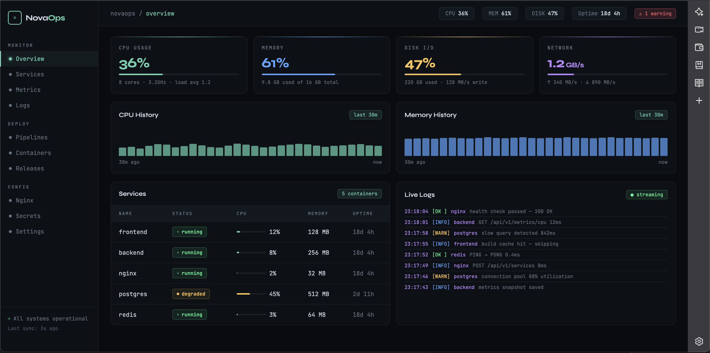

# NovaOps — Infrastructure Monitoring Dashboard

A production-grade DevOps portfolio project demonstrating **Docker**, **CI/CD with GitHub Actions**, **Nginx reverse proxy**, and a **real-time monitoring dashboard** built with Next.js and FastAPI.



---

## Tech Stack

**Frontend**
- Next.js 14 (App Router) + TypeScript
- Tailwind CSS
- Recharts — real-time CPU, memory, disk, network charts
- SWR — data fetching with auto-refresh

**Backend**
- FastAPI (Python) — system metrics via `psutil`
- Pydantic v2 — data validation
- Auto-generated OpenAPI docs at `/docs`

**DevOps**
- Docker + Docker Compose — multi-service orchestration
- Nginx — reverse proxy + rate limiting
- GitHub Actions — full CI/CD pipeline (test → build → push → deploy)
- GHCR (GitHub Container Registry) — Docker image storage
- SSH deploy — zero-downtime production updates

---

## Architecture

```
Internet → Nginx (:8081/:8443)
              ├── /api/*  → FastAPI backend (:8000)
              └── /*      → Next.js frontend (:3000)
```

---

## Getting Started

### Prerequisites
- Docker + Docker-Compose
- Node.js 20+
- Python 3.12+

### Run locally with Docker

```bash
git clone https://github.com/your-username/novaops
cd novaops
cp .env.example .env
docker-compose up --build
```

> [!NOTE]
> Local Nginx binds to port `8081` (HTTP) and `8443` (HTTPS) to prevent port conflicts with active Kubernetes clusters (like Kind) on port `80/443`.

Open **http://localhost:8081** — Nginx will route automatically.

- Main Entrypoint (Nginx): http://localhost:8081
- Frontend (Next.js): http://localhost:3000
- Backend API (FastAPI): http://localhost:8000
- API Docs (Swagger): http://localhost:8000/docs

### Run locally without Docker

```bash
# 1. Start Backend
cd backend
python3 -m venv venv
source venv/bin/activate
pip install -r requirements.txt
uvicorn app.main:app --reload

# 2. Start Frontend (In a separate terminal)
cd frontend
npm install
npm run dev
```

---

## CI/CD Pipeline

```
Push to main
    │
    ├── test-backend  (pytest)
    ├── test-frontend (lint + build)
    │
    └── [if tests pass]
           ├── Build Docker images
           ├── Push to GHCR
           └── Deploy to VPS via SSH
```

### Required GitHub Secrets

| Secret | Description |
|--------|-------------|
| `SERVER_HOST` | Production server IP |
| `SERVER_USER` | SSH username |
| `SERVER_SSH_KEY` | Private SSH key |

---

## API Endpoints

| Method | Endpoint | Description |
|--------|----------|-------------|
| `GET` | `/health` | Health check |
| `GET` | `/api/v1/overview` | System overview |
| `GET` | `/api/v1/metrics/cpu` | CPU metrics |
| `GET` | `/api/v1/metrics/memory` | Memory metrics |
| `GET` | `/api/v1/metrics/disk` | Disk metrics |
| `GET` | `/api/v1/metrics/network` | Network metrics |
| `GET` | `/api/v1/services/` | List all services |
| `GET` | `/api/v1/services/{name}` | Service details |

---

## Deploy to Production (VPS)

```bash
# On your server
git clone https://github.com/your-username/novaops /opt/novaops
cd /opt/novaops
cp .env.example .env  # fill in production values
chmod +x scripts/deploy.sh
./scripts/deploy.sh
```

After setup, GitHub Actions handles all future deploys automatically on push to `main`.

---

## Author

**João de Oliveira Lima Neto** — Full Stack & DevOps Developer
[GitHub](https://github.com/joaooln) · [Upwork](https://upwork.com)

---

## License

MIT
